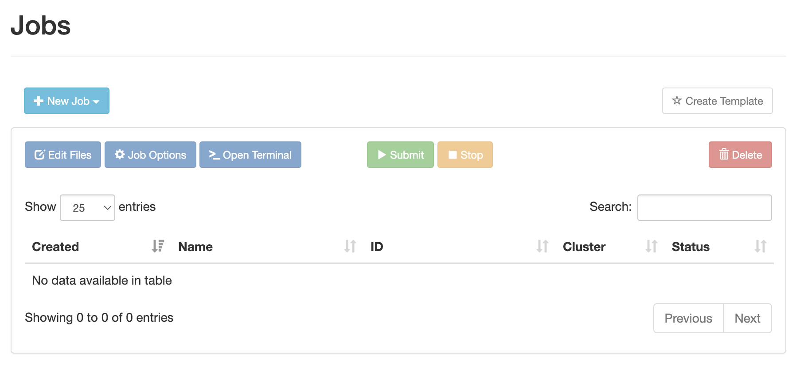
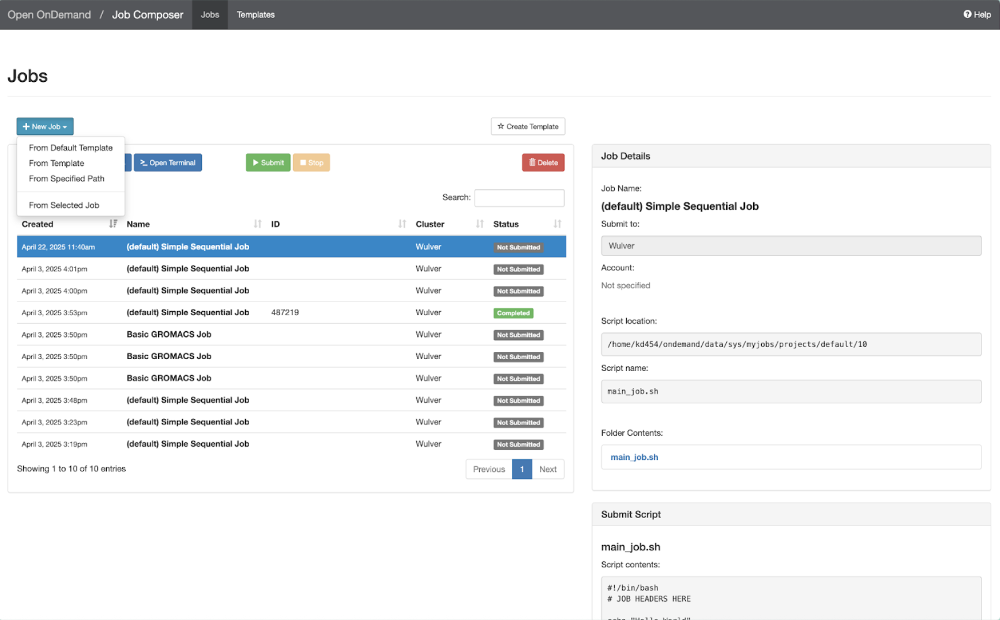
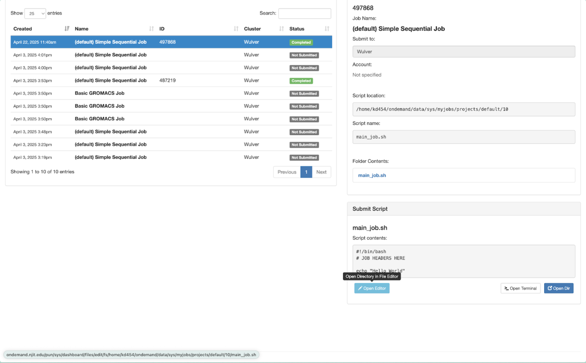
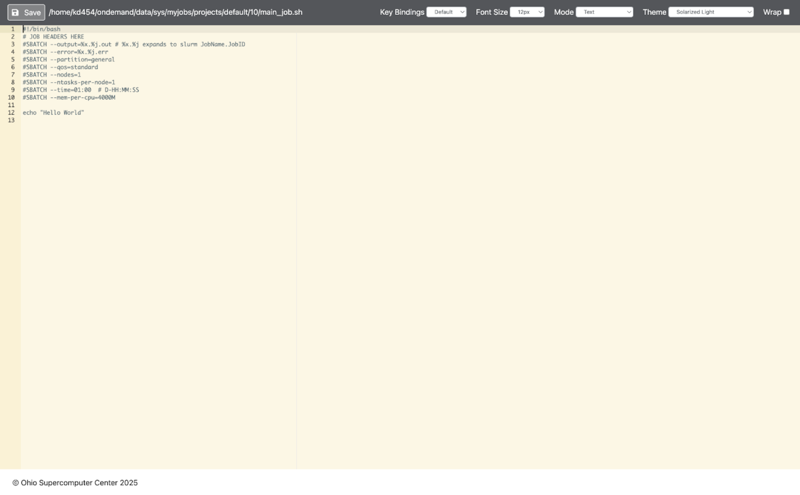
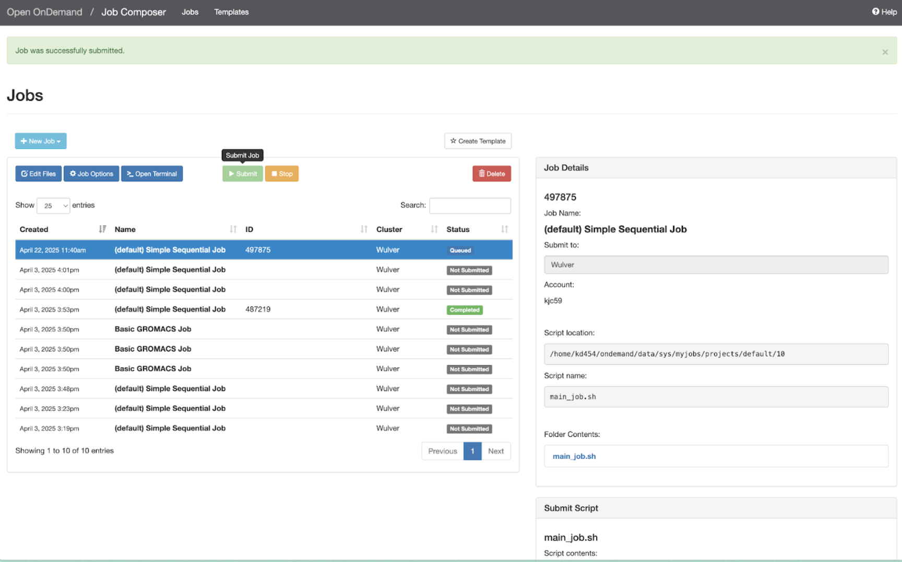
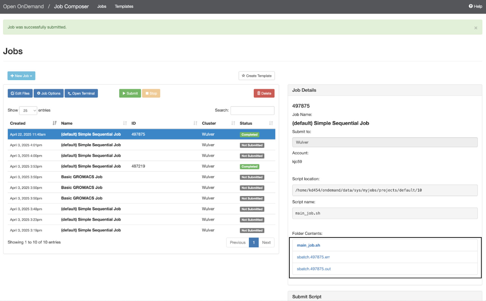
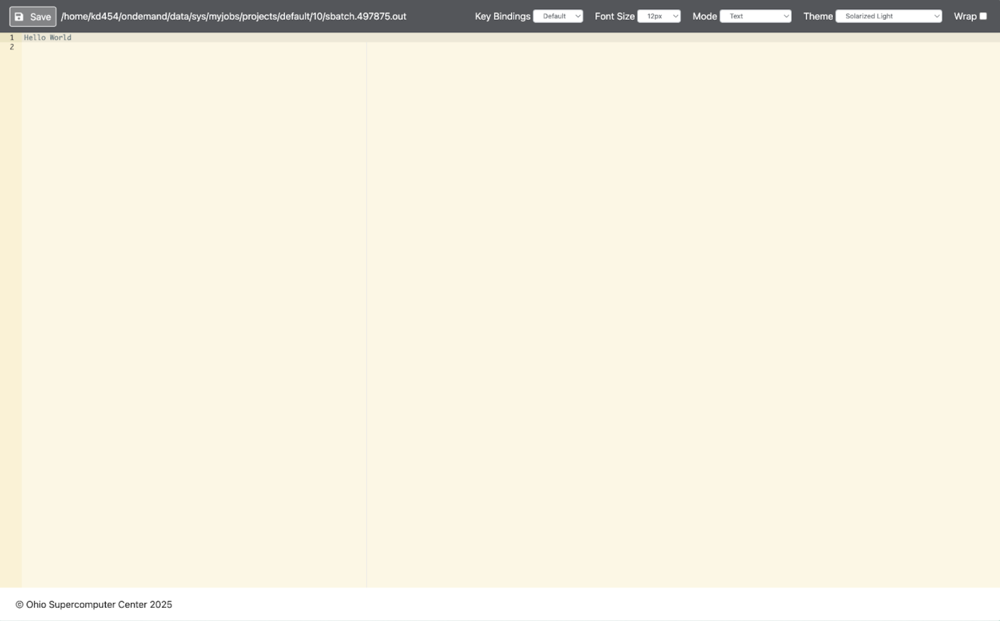
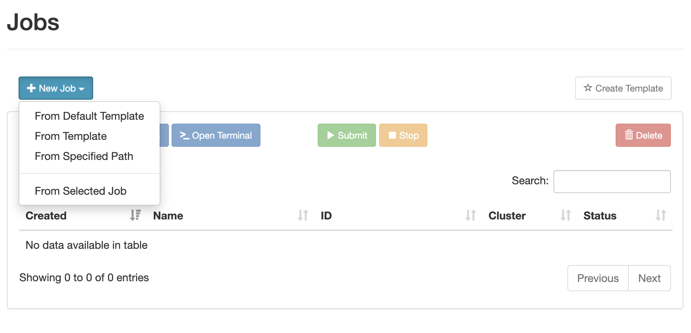
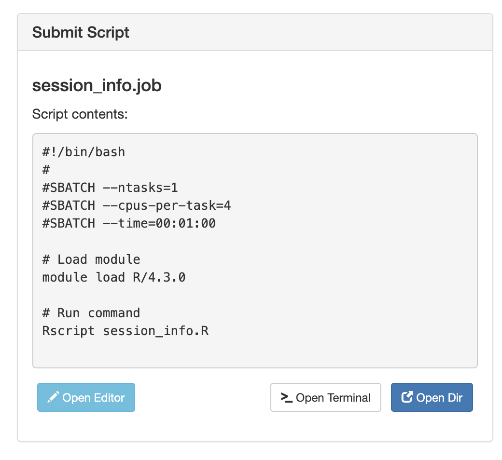

# Jobs
## Overview

The Jobs menu on the menu bar includes both the Job Composer and the Active Jobs tools. The Job Composer assists you to set up and submit jobs to the cluster through a graphical interface using file management tools and access to job templates. 

{ width=80% height=80%}


## Job Composer

{ width=60% height=60%}

### Creating a New Job

=== "From Default Template"

    - Click New Job > From Default Template

    { width=60% height=60%}

    - A new job (e.g., Simple Sequential Job) will appear in your job list.

    - Click Open Editor to open the directory in the File Editor.

    { width=60% height=60%}

    - Modify the main_job.sh script as needed.

    { width=60% height=60%}

    - Return to the Job Composer and click Job Options to adjust:
        - Job Name
        - Cluster (ensure it’s set to wulver)
        - Account (It will take the default account. If you have or ever had multiple accounts then you have to specify your account)

    { width=60% height=60%}

    - Click Save to apply changes.    


=== "From Existing Job"

    - Select an existing job from your list.
    - Click New Job > From Selected Job.
    - This duplicates the job, allowing you to modify it without altering the original.

=== "From Specified Path"

    - Click New Job > From Specified Path.
	- Enter the full path to a directory containing your job script and necessary files.
	- This is useful for jobs prepared outside the Job Composer.

### Editing the Job Script

1. In the Job Composer, locate your job and click Open Editor under the Submit Script section.
2. Modify the main_job.sh script with your desired commands and SLURM directives. For example:
```
#SBATCH --output=%x.%j.out # %x.%j expands to slurm JobName.JobID
#SBATCH --error=%x.%j.err
#SBATCH --partition=general
#SBATCH --qos=standard
#SBATCH --nodes=1
#SBATCH --ntasks-per-node=1
#SBATCH --time=01:00  # D-HH:MM:SS
#SBATCH --mem-per-cpu=4000M
```
3. Ensure you adjust the SLURM directives (#SBATCH lines) according to your job’s requirements.
4. Click **Save** after editing.

### Submitting the Job

1. In the Job Composer, select your job.
2. Click Submit.
3. Monitor the job’s status under the Active Jobs tab.
    - Queued: Waiting for resources.
	- Running: Currently executing.
	- Completed: Finished execution.

{ width=60% height=60%}

### Outputs

- You can check the output/error in folder contents

{ width=60% height=60%}

- Check both files to confirm your program ran successfully.

{ width=60% height=60%}

!!! Note
    Even if an error might have occurred, your job status will still show complete.


## Active Jobs

The Active Jobs tool will allow you to view all the jobs you’ve submitted that are currently in the queue, via OnDemand or not, so you can check on their status.   
{ width=60% height=60%}

{ width=50% height=50%}

{ width=50% height=50%}
