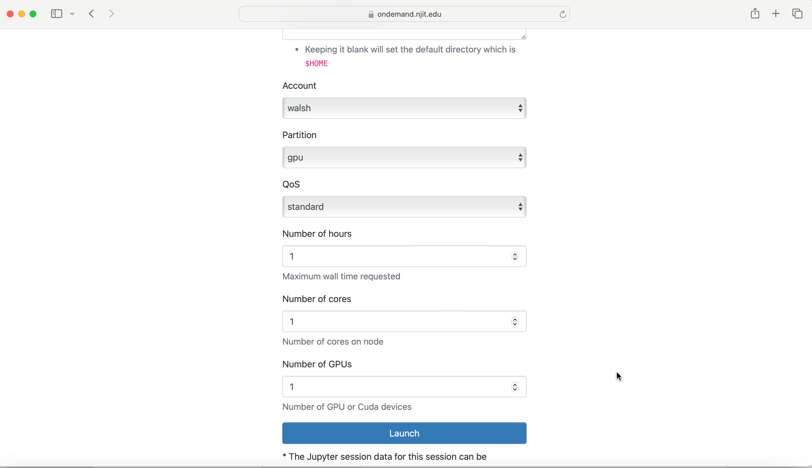
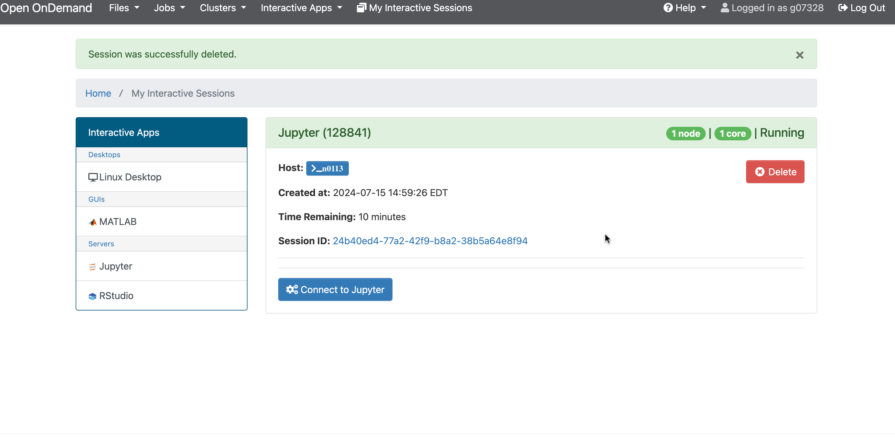
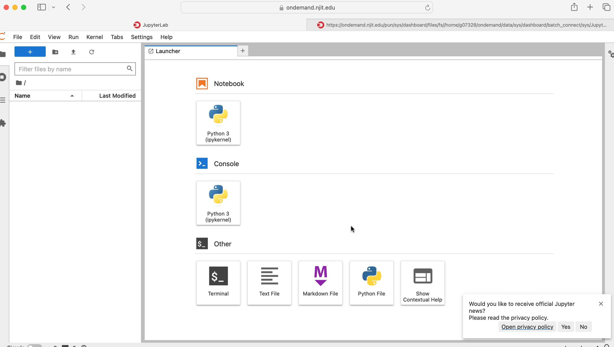

# Jupyter

## Launching Jupyter Session

* Navigate to the Interactive Apps section.
* Select `Jupyter` from the list of available applications.

## Loading the Environment 

* Choose the `Mode` option, where you can select the interface:
    - Jupyterlab 
    - Jupyter Notebook

* In the `Conda Environment` section, you can see all your conda environments automatically detected, please select the one which you want to work with. 

!!! Note
    Please make sure that Jupyter package is installed in your conda env otherwise you will get an error. If you are unsure how to install Jupyter Notebook or Jupyterlab in the Conda environment, check [Conda Documentation](conda.md) and [Jupyter Installation](jupyter.md).

* Choose the path where you want to start the Jupyter session in `Enter the full path of the case directory`. For session in `$HOME` directory keep this blank. 

{ width=60% height=60%}

## Configuring Resources

* Specify your Slurm account/partition/qos.
* Set the maximum wall time requested.
* Choose the number of cores you need.
* If required, specify the number of GPUs.

{ width=60% height=60%}

{ width=60% height=60%}

## Launching the Session

Select the `Launch` option after finalizing the resources. Once clicking **Launch**, the request will be queued, and when resources have been allocated, you will be presented with the option to connect to the session by clicking on the blue `Connect to Jupyter` option.

{ width=60% height=60%}

{ width=60% height=60%}

