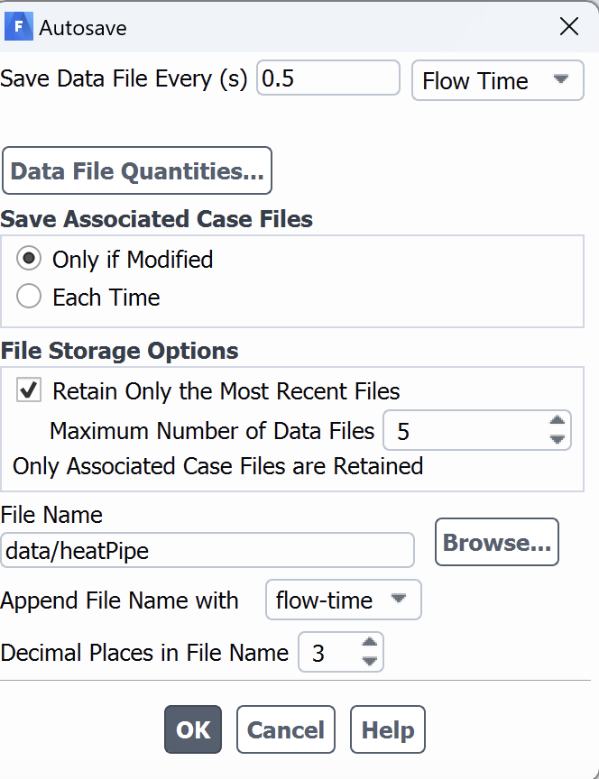

## Availability

=== "Wulver"

    ```python exec="on"
    import pandas as pd
    
    df = pd.read_csv('docs/assets/tables/module_wulver_rhel9.csv')
    soft = df.query('Software == "fluent" | Software == "ANSYS"')
    print(soft.to_markdown(index=False))
    ```

## Application Information, Documentation
To use Fluent on cluster, Users need to prepare the case using ANSYS on their local machine first. Please [download](https://njit.instructure.com/courses/8519/assignments/128626) ANSYS and follow the [instructions](https://ist.njit.edu/ansys-installation-instructions) to install ANSYS on your local machine.

## Using Fluent
To use Fluent in cluster, users first need to prepare the fluent case (meshing, setting boundary conditions) on their local machine  and save the case and data in `.cas` and `.dat` format respectively. 
If you are running transient problem and want to save the data at particular timestep or time interval, please see the steps below.

* Go to `Calculation Activities` option in the left pane and double-click the `Autosave (Every  Flow Time)` option, you will notice a separate dialogue box `Autosave`, where you need to specify how frequently you want to save the data, you can choose eiter `timestep` or `Flow Time` interval. In the `File name` option you need to specify the subdirectory where you want to save the data and the case name. In the example shown below the subdirectory is `data` and the problem name is heatpipe. You need to make sure to create the subdirectoy (`data` in this example) in the cluster where you want to intend to submit the job script.

   { width=30% height=30%}

   This is required if your job is somehow cancelled, or you need to restart from specific flow time.

* If you want  to ppstprocess the data using a different software , e.g. [Tecplot](tecplot.md) or [ParaView](paraview.md), you need to save the data in different file format at certain flow time or time step interval.  To set up the postprocessing configuration, select `File --> Export --> During Calculation --> Solution Data` option (see the figure below)
   
   { width=80% height=80%}

* Once you open the configuration, you will notice separate dialogue box `Automatic Export`. You need the file format in `File Type` option. Select the drop-down option to see different options. In this example above, `ensight` format has been selected. In right pane, you need to select which parameters you want to visualize. In the example above, `Volume Fraction` for different phases have been selected. 
* Next, you to select the file name and the subdirectory on cluster where you intend to write the post processed data. In this example, we choose to write the files in `ensi` subdirectory. Please make sure to create this subdirectory inside case directory on cluster before running the simulation. 
* You can also set how often you want to write your data. You need to select `Export Data Everty (s)` option in terms of time step interval or flow time interval.  
* Once you set up your case and initialize the problem, you need to go to `File --> write --> case and data` option to write the case and data in `.cas` and `.dat` respectively. 
* Transfer the `.cas` and `.dat` files to the cluster. See the [steps to transfer the data](cluster_access.md#transfer-the-data-from-the-local-machine-to-clusters-or-vice-versa) for transferring the files from local machine to cluster.
* Once you transfer the files, log on the cluster and go the directory where you transferred the `.cas` and `.dat` files. 
* Create a journal file which defines the input data file and some additional settings required by Fluent.  You can use the following journal file

??? example "Sample journal file : journal.JOU"
    
    ```bash
       /file/set-tui-version "21.1"
       /file/read-case-data tube_vof.cas.h5
       solve/dual-time-iterate 20 50
       (print-case-timer)
       parallel/timer/usage
    ```
In the above `Journal` script, the full name of case file (`tube_vof.cas.h5`) is mentioned. You need to modify based on the case file based on the problem.  
The `solve/dual-time-iterate` specifies the end flow time and number of iterations. In the above example, `20` is the end flow time while the maximum number of iterations are `50`. The "dual-time" approach allows for a larger time step size by introducing an additional iteration loop within each time step. Users can select different approach based on their problems and need to modify it accordingly. 
<!-- 
For more details on journal commands, see the Fluent text user interface (TUI) commands from [Fluent documentation](../../assets/Ansys_Fluent_Text_Command_List.pdf).
-->

??? example "Sample Batch Script to Run FLUENT : fluent.submit.sh"
    
    === "Wulver"

        ```slurm
        #!/bin/bash -l
        #SBATCH --job-name=fluent
        #SBATCH --output=%x.%j.out # i%x.%j expands to slurm JobName.JobID
        #SBATCH --error=%x.%j.err # prints the error message
        # Use "sinfo" to see what partitions are available to you
        #SBATCH --partition=general
        #SBATCH --ntasks=8
        #SBATCH --qos=standard
        #SBATCH --account=PI_ucid # Replace PI_ucid which the NJIT UCID of PI
        # Memory required; lower amount gets scheduling priority
        #SBATCH --mem-per-cpu=2G
        
        # Time required in d-hh:mm:ss format; lower time gets scheduling priority
        #SBATCH --time=71:59:00
        
        # Purge and load the correct modules
        module purge > /dev/null 2>&1
        module load wulver # Load the slurm, easybuild 
        module load ANSYS
        
        # Run the mpi program
        
        machines=hosts.$SLURM_JOB_ID
        touch $machines
        for node in `scontrol show hostnames`
            do
                echo "$node"  >> $machines
            done
        
        fluent 3ddp -affinity=off -ssh -t$SLURM_NTASKS -pib -mpi=intel -cnf="$machines" -g -i journal.JOU
        ```

    
Submit the job using `sbatch fluent.submit.sh` command.


## Related Applications

* [OpenFOAM](openfoam.md)

## User Contributed Information

!!! info "Please help us improve this page"

    Users are invited to contribute helpful information and corrections through our [Github repository](https://github.com/arcs-njit-edu/Docs/issues).


