# Use MATLAB on NJIT HPC

## Installation steps of MATLAB on local machine
* Go to [Mathworks Download](https://www.mathworks.com/downloads/) and register with your NJIT email address.
* Select the **R2022a** version to download. 
* User needs to select the correct installer based on the OS (Mac or Windows). 
* Run the installer.

   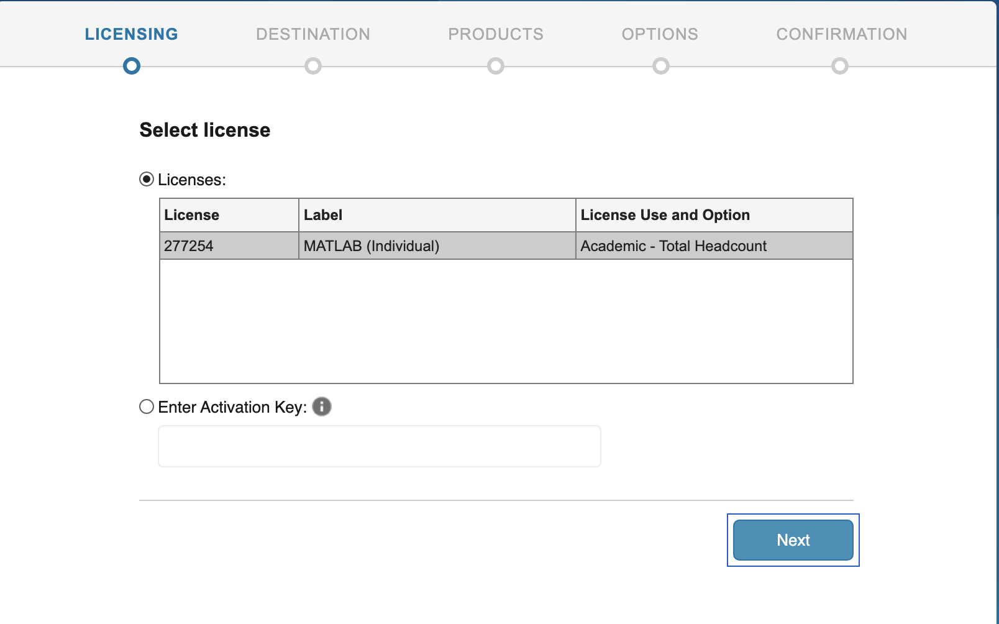
   

* Make sure to check **Parallel Computing Toolbox** option.
   
    

* Continue by selecting **Next** and MATLAB will be installed on your computer.

## Setup Slurm profile to run MATLAB on Lochness
Following this procedure a user will be able to submit jobs to lochness or stheno from Matlab running locally on the user's computer.

### Installing the Add-On

From the Matlab window, click on "Add-ons" and select "Get Add-Ons."
 
   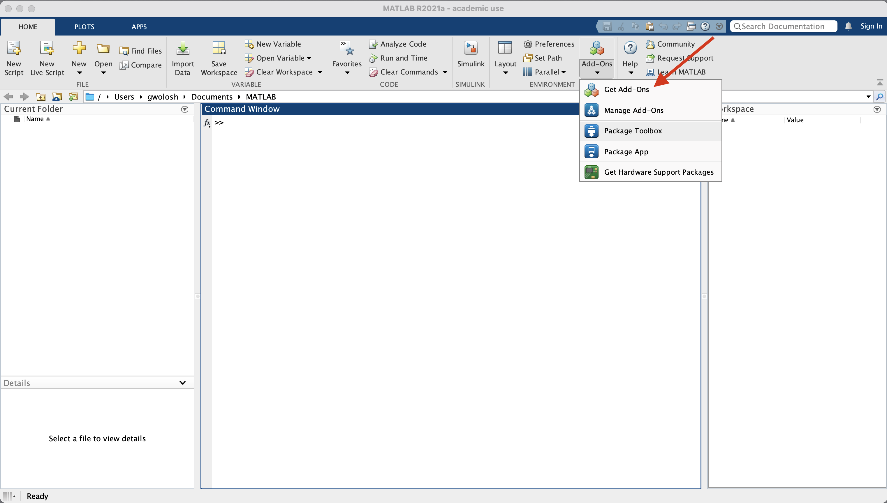

In the search box enter "slurm" and click on the magnifying glass icon. Select "Parallel Computing Toolbox plugin for MATLAB Parallel Server with Slurm". Alternatively, this Add-On can be downloaded directly from the [Mathworks](https://www.mathworks.com/matlabcentral/fileexchange/52807-parallel-computing-toolbox-plugin-for-matlab-parallel-server-with-slurm) site.
   
   

Click on "Install."

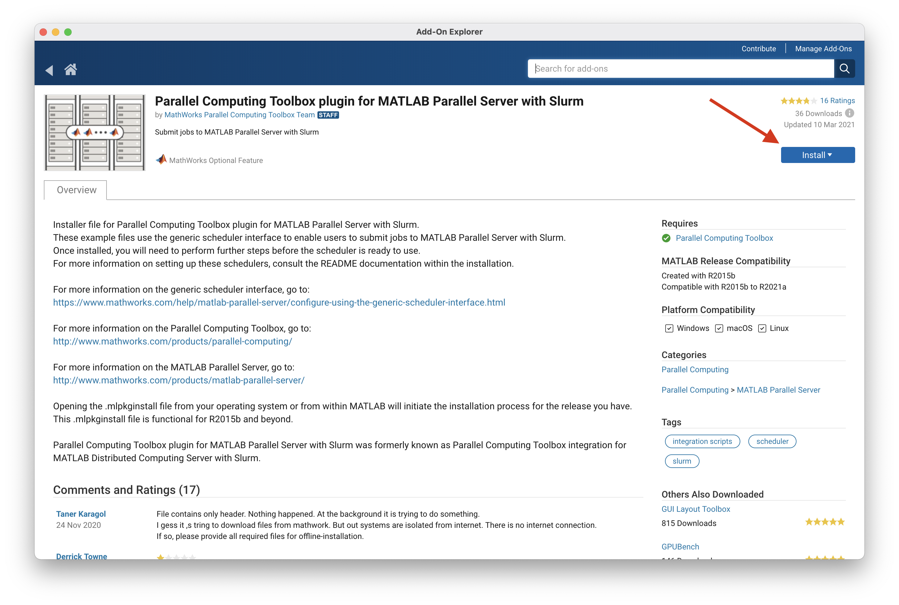

### Creating a Profile for Lochness or Stheno

The following steps will create a profile for lochness (or stheno). Click "Next" to begin.

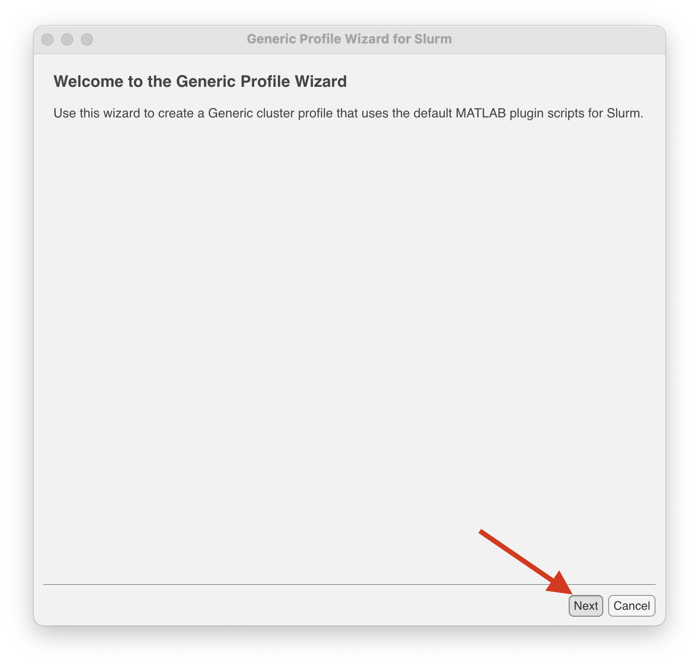

In the "Operating System" screen "Unix" is already selected. Click "Next" to continue.

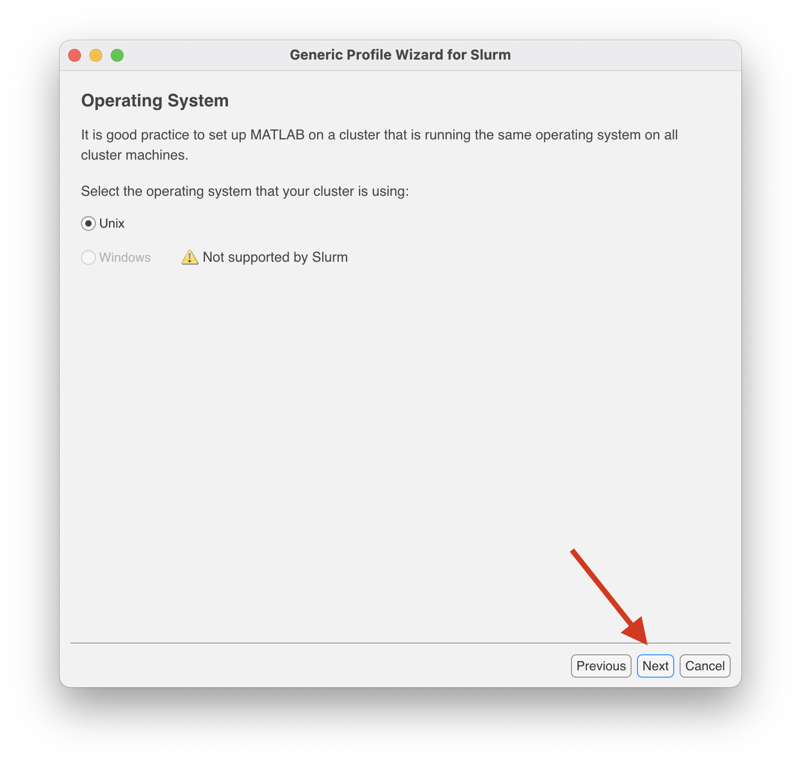

This "Submission Mode" screen determines whether or not to use a "shared" or "nonshared" submission mode. Since Matlab installed on your personal computer or laptop does not use a shared job location storage, select "No" where indicated and click "Next" to continue.

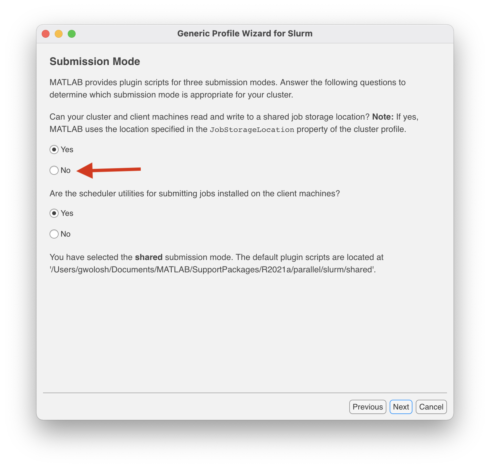

Click "Next" to continue.

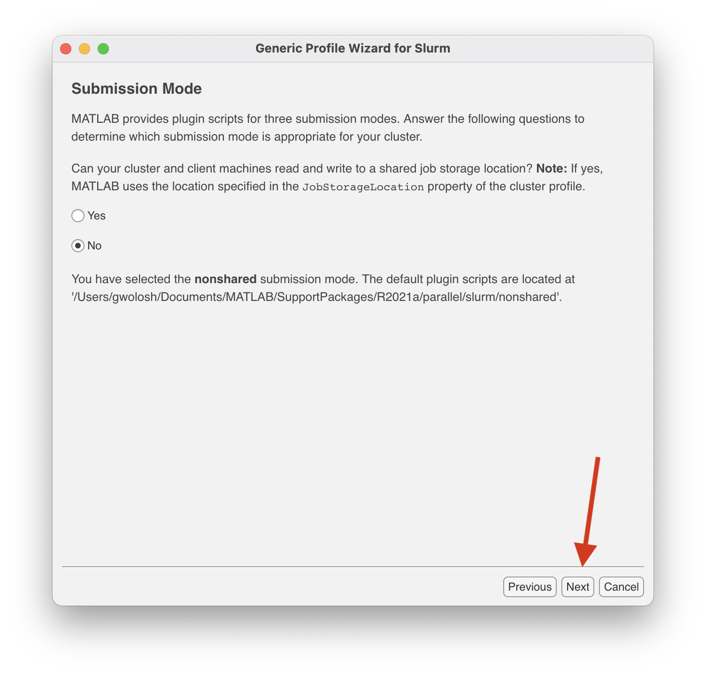

In the "Connection Details" screen, enter the cluster host, either "lochness.njit.edu" or "stheno.njit.edu." Enter your UCID for the username. Select "No" for the "Do you want to use an identity file to log in to the cluster" option and click next to continue.

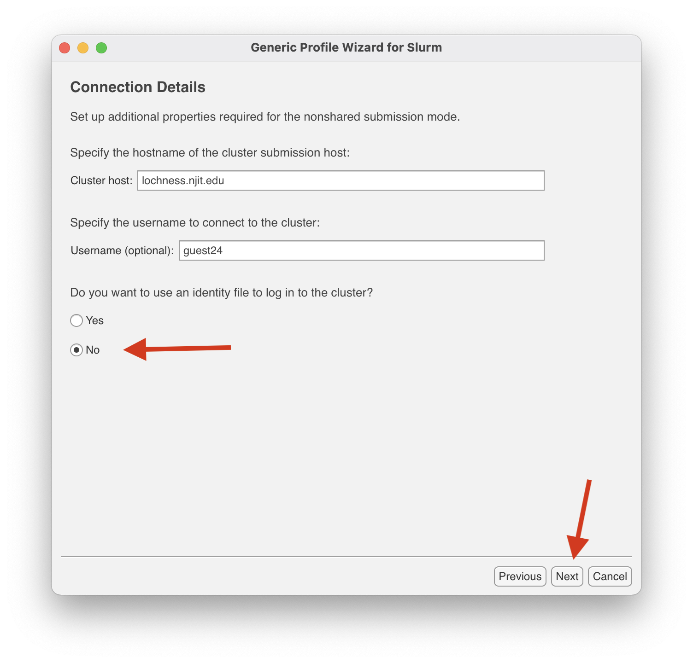

In the "Cluster Details" screen enter the full path to the directory on lochness to store the Matlab job files. In the case the directory is $HOME/MDCS. MDCS stands for Matlab Distributed Computing Server. It is not necessary to name this directory MDCS. This directory can be named anything you wish. To determine the value of $HOME, logon to lochness. For details on how to Logon to Lochness from local computer please see this [link](https://hackmd.io/@absrocks/BJRlQtBVi). Once connected to Lochness run the following:

```
  login-1-45 ~ >: echo $HOME
  /home/g/guest24
```

Make sure to check the box "Use unique subfolders." Click "Next" to continue.

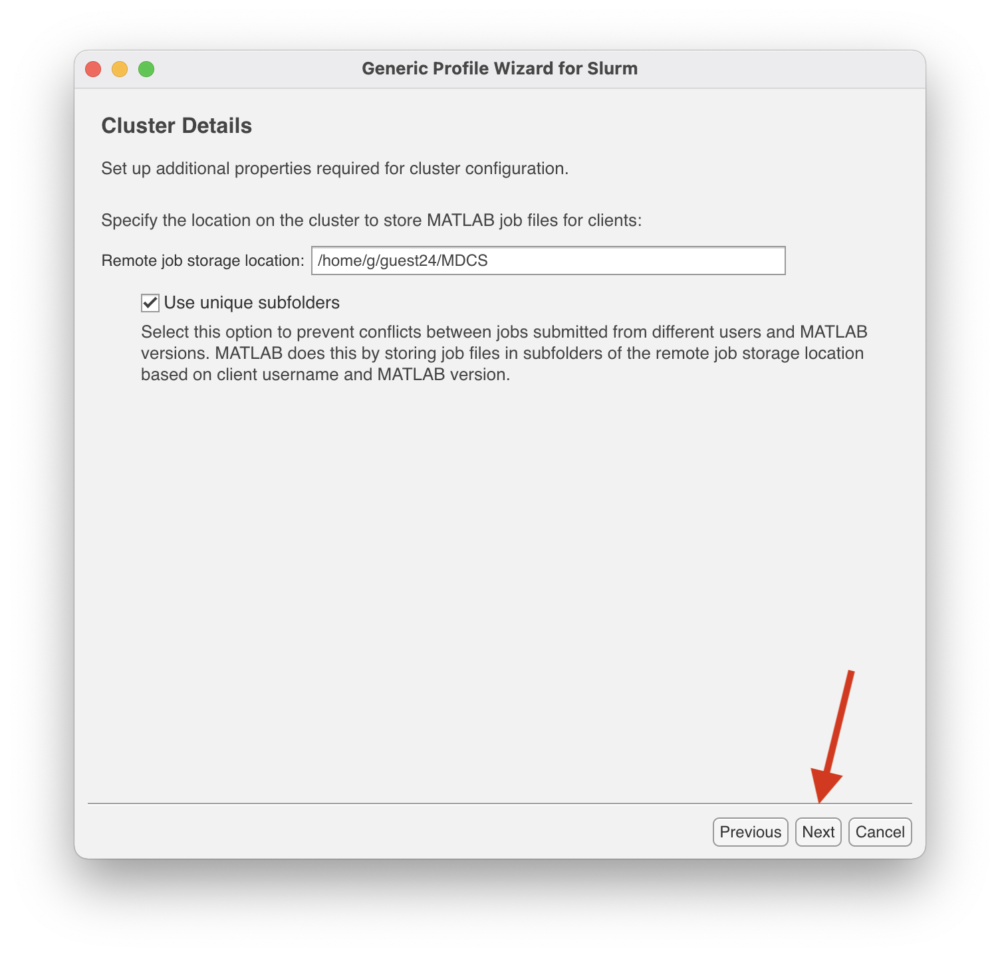

In the "Workers" screen enter "512" for the number of workers and "/opt/site/easybuild/software/MATLAB/2022a" for "MATLAB installation folders for workers." Click "Next" to continue.

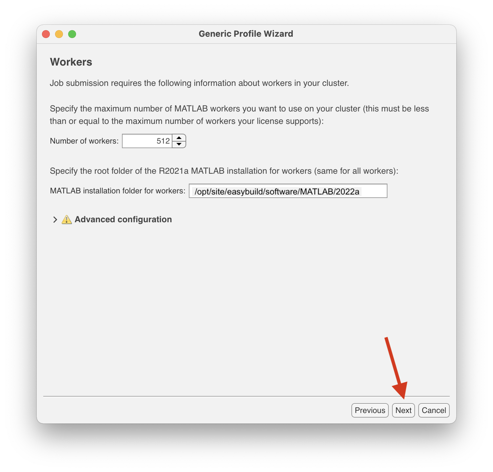

In the "License" screen make sure to select "Network license manager" and click "Next" to continue.


In the "Profile Details" screen enter either "Lochness" or "Stheno" depending on which cluster you are making a profile for. The "Cluster description" is optional and may be left blank. Click "Next"to continue.


In the "Summary" screen make sure everything is correct and click "Create."

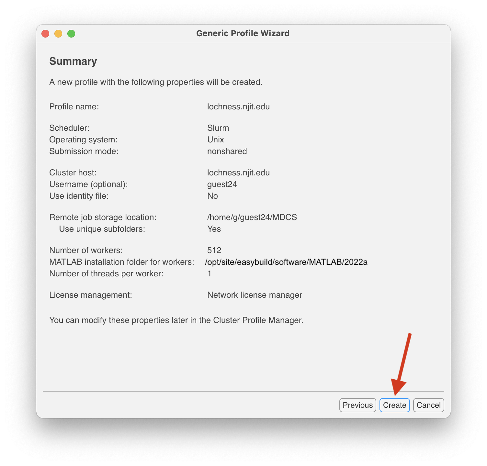

In the "Profile Created Successfully" screen, check the "Set the new profile as default" box and click on "Finish."


## Submitting a Serial Job
This section will demonstrate how to create a cluster object and submit a simple job to the cluster. The job will run the 'hostname' command on the node assigned to the job. The output will indicate clearly that the job ran on the cluster and not on the local computer.

The hostname.m file used in this demonstration can be downloaded [here](https://www.mathworks.com/matlabcentral/fileexchange/24096-hostname-m).

```
 >> c=parcluster 
```
 

Certain arguments need to be passe dto SLURM in order for the job to run properly. Here we will set values for partion, mem-per-cpu and time. In the Matlab window enter:
```
 >> c.AdditionalProperties.AdditionalSubmitArgs=['--partition=public --mem-per-cpu=10G --time=2-00:00:00'] 
```
To make this persistent between Matlab sessions these arguments need to be saved to the profile. In the Matlab window enter:
```
 >> c.saveProfile 
```
 
 
We will now submit the hostname.m function to the cluster. In the Matlab window enter the following:
```
>> j=c.batch(@hostname, 1, {}, 'AutoAddClientPath', false); 
```
@: Submitting a function.\
1: The number of output arguments from the evaluated function.\
{}: Cell array of input arguments to the function. In this case empty.\
'AutoAddClientPath', false: The client path is not available on the cluster.


When the job is submitted, you will be prompted for your password.

For more information see the Mathworks page: [batch](https://www.mathworks.com/help/parallel-computing/batch.html) 


To wait for the job to finish enter in the Matlab window:
```
 >>j.wait
```
Finally, to get the results:
```
 >>fetchOutputs(j)
```
As can be seen, this job ran on node720


### Submitting a Parallel Function
The "Job Monitor" is a convenient way to monitor jobs submitted to the cluster. In the Matlab window select "Parallel" and then "Monitor Jobs."

For more information see the Mathworks page: [Job Monitor](https://www.mathworks.com/help/parallel-computing/job-monitor.html)


Here we will submit a simple function using a "parfor" loop. The code for this example is as follows:
```
function t = parallel_example

t0 = tic;
parfor idx = 1:16
        A(idx) = idx;
        pause (2)
end

t=toc(t0);
```
To submit this job:
```
 >> j=c.batch(@parallel_example, 1, {}, 'AutoAddClientPath', false, 'Pool', 7)
```
Since this is a parallel job a 'Pool' must be started. The actual number of tasks started will be one more than requested in the pool. I this case, the batch command calls for a pool of seven. Eight tasks will be started on the cluster.

Also see that the state of the job in the "Job Monitor" is "running."


The job takes a few minutes to run and the state of the job changes to "finished."


Once again to get the results enter:
```
 >> fetchOutputs(j) 
```
As can be seen the parfor loop was completed in 6.7591 seconds.


## Submitting a Script Requiring a GPU
In this section we will submit a matlab script using a GPU. The results will be written to the job diary. The code for this example is as follows:
```
% MATLAB script that defines a random matrix and does FFT
%
% The first FFT is without a GPU
% The second is with the GPU
%
% MATLAB knows to use the GPU the second time because it
%   is passed a type gpuArray as an argument to FFT
% We do the FFT a bunch of times to make using the GPU worth it,
%   or else it spends more time offloading to the GPU
%   than performning the calculation
%
% This example is meant to provide a general understanding
%   of MATLAB GPU usage
% Meaningful performance measurements depend on many factors
%   beyond the scope of this example
% Downloaded from https://projects.ncsu.edu/hpc/Software/examples/matlab/gpu/gpu_m

% Define a matrix
A1 = rand(3000,3000);

% Just use the compute node, no GPU
tic;
% Do 1000 FFT's
for i = 1:1000
      B2 = fft(A1);
end
time1 = toc;
fprintf('%s\n',"Time to run FFT on the node:")
disp(time1);

% Use GPU
tic;
A2 = gpuArray(A1);
% Do 1000 FFT's
for i = 1:1000
      % MALAB knows to use GPU FFT because A2 is defined by gpuArray
        B2 = fft(A2);
end
time2 = toc;
fprintf('%s\n',"Time to run FFT on the GPU:")
disp(time2);

% Will be greater than 1 if GPU is faster
speedup = time1/time2 
```
We will need to change the partition to datasci and request a gpu. In the Matlab window enter:
```
 >> c.AdditionalProperties.AdditionalSubmitArgs=['--partition=datasci --gres=gpu:1 --mem-per-cpu=10G --time=2-00:00:00'] 
```


Submit the job as before. Since a script is submitted as opposed to a function, only the name of the script is included in the batch command. Do not include the '@' symbol. In a script there are no inputs or ouptuts.
```
 >> j=c.batch('gpu', 'AutoAddClientPath', false) 
```
 
 
To get the result:
```
 >> j.diary 
```


## Load and Plot Results from A Job
In this section we will run a job on the cluster and then load and plot the results in the local Matlab workspace. The code for this example is as follows:
```
n=100;
disp("n = " + n);
A = gallery('poisson',n-2);
b = convn(([1,zeros(1,n-2),1]'|[1,zeros(1,n-1)]), 0.5*ones(3,3),'valid')';
x = reshape(A\b(:),n-2,n-2)';%
```
As before submit the job:
```
 >> j=c.batch('plot_demo', 'AutoAddClientPath', false);
```


To load 'x' into the local Matlab workspace:
```
 >> load(j,'x') 
```
 
 
 Finally, plot the results:
```
 >> plot(x) 
```

 