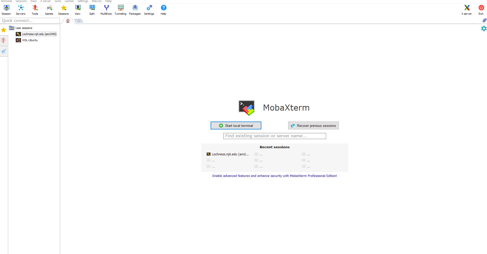
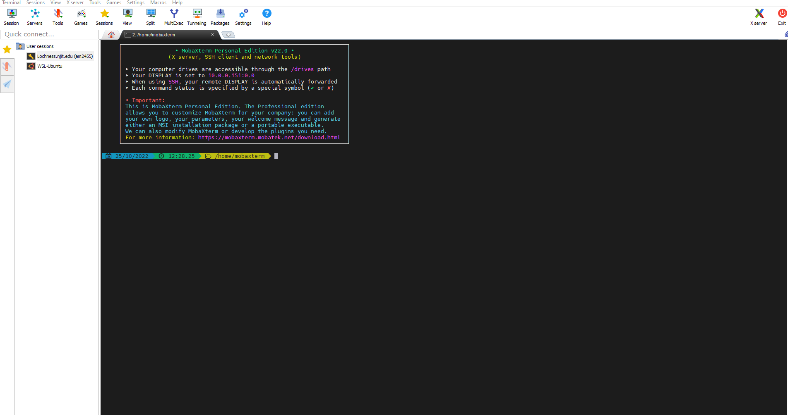
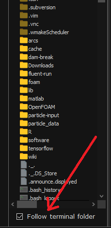

# Access to NJIT Clusters
The following instructions are provided to access NJIT HPC clusters from a local computer.

## Getting a Login
Faculty can obtain a login to NJIT's HPC by sending an email to [hpc@njit.edu](mailto:hpc@njit.edu). Students can obtain a login either by taking a class that uses one of the systems or by asking their faculty adviser to [contact](mailto:hpc@njit.edu) on their behalf. Your login and password are the same as for any NJIT AFS system.

## Access to Clusters
Make sure the user is connected to `NJITsecure` if the user is on campus. If working off campus, NJIT VPN is required. Please find the details [here](https://ist.njit.edu/vpn).
Here we will provide instructions for connecting to NJIT HPC on Mac/Linux and Windows OS.

!!! Update

    In the recent update (Sep 10th 2024) Cisco two-factor authentication (TFA) is deployed, similar to what is already deployed on NJIT websites and VPN. 

=== "Mac/Linux"

    Open terminal from <kbd>Launchpad</kbd> and select <kbd>terminal</kbd>.
    Type the following in the terminal and replace `$UCID` with your NJIT UCID..
    ```
      localhost> ssh -X -Y $UCID@wulver.njit.edu  
    ```
    
    Users will be prompted for your password. Enter your NJIT UCID password. Users can omit the `-X -Y` if you are not using a graphic interface. Once the password is provided, User will authenticate via Cisco two-factor authentication (TFA)
    
    ```
    (guest@wulver.njit.edu) Duo two-factor login for guest

    Enter a passcode or select one of the following options:

    1. Duo Push to XXX-XXX-2332
    2. Phone call to XXX-XXX-2332
    3. SMS passcodes to XXX-XXX-2332 (next code starts with: 1)

    Passcode or option (1-3):
    ```
      
    Based on the option provided, user will be logged in after succesfull authetication.  

=== "Windows"

    Download the MobaXterm from this [link](https://mobaxterm.mobatek.net/download-home-edition.html). 
    Open MobaXterm after installation is completed. 
    Select <kbd>Start local terminal</kbd> to open the terminal.
    
    
    
    Type `ssh $UCID@wulver.njit.edu`. Replace `$UCID` with your NJIT UCID.
    
    . 
    
    User will be prompted to type the password. The password is NJIT UCID password.
    After successful login, user will see the following in the terminal, which means the user is now connected to HPC.
    
    ```
    Last login: Tue Oct 25 12:37:31 2022 from 10.192.228.138
    Starting /home/a/user/.bash_profile ... standard AFS bash profile
    
    ========================
    Home directory : /home/u/user is not in AFS -- skipping quota check
    ========================
    
    On host login-1 :
             12:38:05 up 315 days, 22:36, 35 users,  load average: 10.32, 10.10, 10.63
    
    === === === Your Kerberos ticket and AFS token status === === ===
    Kerberos :  Renew until 10/26/22 12:38:01, Flags: FRIA Renew until 10/26/22 12:38:01, Flags: FRA
    AFS      :  User's (AFS ID 105631) tokens for afs@cad.njit.edu [Expires Oct 25 22:38]
    
    Running your /home/u/user/.modules file:
    
    To see your aliases, enter "alias"
    
    login-1-41 ~ >:
    ```

## Transfer the Data from the Local Machine to Clusters or vice versa

=== "Mac/Linux"

    Users need to use the command in the terminal to transfer in and out the data.  

    ### `rsync`:
    * Transfer the data from local machine to HPC cluster
    ```
    rsync -avzP /path/to/local/machine $UCID@wulver.njit.edu:/path/to/destination
    ```
    
    * To transfer the data from HPC cluster to local machine use
    ```
    rsync -avzP $UCID@wulver.njit.edu:/path/to/source /path/to/local/machine
    ```
    ### `scp`:
    * Copy files from remote machine to local machine
    ```
    scp [option] [$UCID@wulver.njit.edu:path/to/source/file] [target/path]
    ```

    * Copy files from local machine to remote machine
    ```
    scp [option] [path/to/source/file] [$UCID@wulver.njit.edu:target/path] 
    ```

    * Example of scp:
    ```
    scp -r example $UCID@wulver.njit.edu:/home/dir 
    ```
    Copy the “example” folder recursively to `/home/dir`


=== "Windows"

    User needs to select the `follow terminal folder` of the left pane of the MobaXterm terminal. 
    
    
    
    Next, to transfer the data from the local machine to Wulver user needs to select the `Upload to current folder` option, as shown below. Selecting this option will open a dialogue box where user needs to select the files to upload.
    
    
    
    For transferring the data from Wulver to the local machine user needs to select the directory or the data from the left pane and then select `Download selected files`.


